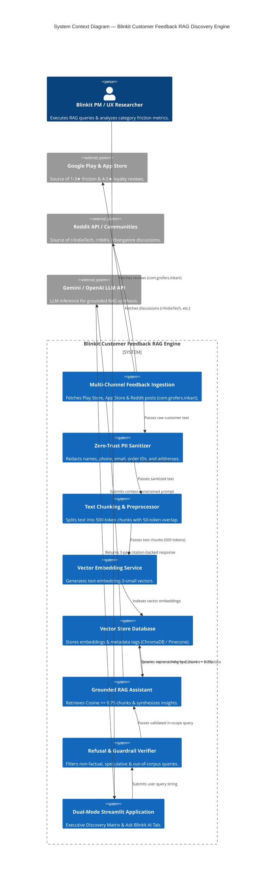
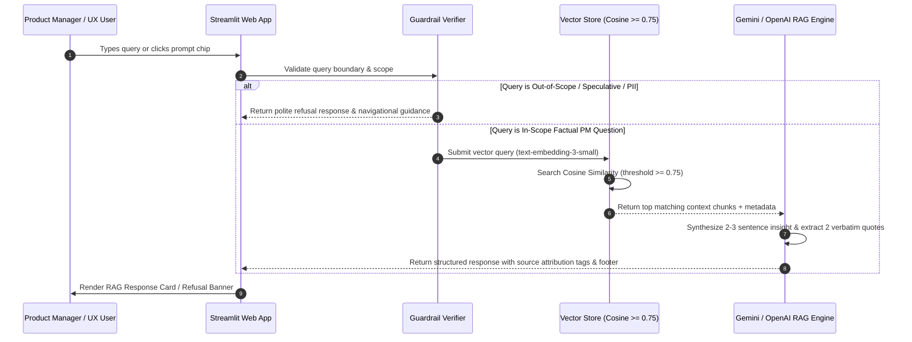

# Blinkit Customer Feedback Intelligence & RAG Discovery Engine — System Architecture

**Project Title:** Blinkit Customer Feedback Intelligence & RAG Discovery Engine  
**Target Organization & Package:** Blinkit (`com.grofers.inkart` / Blinkit Commerce Private Limited)  
**Domain:** Quick Commerce (Q-Commerce) / RAG AI Analytics & User Research Discovery  
**Document Version:** 3.0.0  
**Status:** Approved Architecture Baseline  

---

## 1. Executive Summary

The **Blinkit Customer Feedback Intelligence & RAG Discovery Engine** is an enterprise-grade AI analytics and retrieval-augmented generation (RAG) platform. It ingests, sanitizes, embeds, and indexes multi-channel public customer feedback for Blinkit (`com.grofers.inkart`) across **Play Store/App Store reviews, Reddit tech/local communities, and public unboxing commentary**.

The platform empowers Product Managers (PMs), Growth Strategists, and UX Researchers to execute natural language queries regarding customer cross-category habits (Tech Accessories, Beauty & Personal Care, Home Utilities, Pet Care) and receive **100% grounded, source-attributed responses containing direct verbatim customer quotes with zero hallucinated insights**.

### Core Technical Pillars:
* **Multi-Channel Data Pipeline**: Scrapes and unifies reviews from Play Store/App Store (`com.grofers.inkart`), Reddit (`r/IndiaTech`, `r/delhi`, `r/bangalore`, `r/gurgaon`, `r/india`), and social commentary.
* **Zero-Trust PII Masking Gateway**: Redacts sensitive customer data (`[PHONE_REDACTED]`, `[EMAIL_REDACTED]`, `[ORDER_ID_REDACTED]`, `[ADDRESS_REDACTED]`).
* **High-Precision Vector Retrieval Engine**: Chunks text (500 tokens, 50 token overlap), generates vector embeddings via `text-embedding-3-small`, and enforces a **Cosine Similarity Match Score $\ge 0.75$**.
* **Strict RAG Output Formatter**: Enforces a 3-part response structure: **Synthesized Insight (2–3 sentences)**, **Exactly 2 Verbatim Quotes**, and **Source Metadata Tags** (`[Source: Play Store | 2-Star Review]`, `[Source: Reddit r/IndiaTech]`) with a mandatory verification footer.
* **Refusal & Guardrail System**: Intercepts speculative, financial, stock-related, or personal queries with polite navigational advice.
* **Dual-Mode Streamlit Web UI**: Hosts the **Executive Discovery Matrix** (8 Behavioral Question Cards) and the interactive **"Ask Blinkit AI" RAG Tab** with pre-set prompt chips and a mandatory disclaimer banner.

---

## 2. System Architecture (C4 Model)



---

## 3. End-to-End RAG Ingestion & Vector Retrieval Pipeline

```
+---------------------------------------------------------------------------------------------------------+
|                                END-TO-END RAG PIPELINE FLOW                                            |
+------------------------------------+-----------------------+--------------------------------------------+
| Pipeline Stage                     | Technical Component   | Process & Specification                    |
+------------------------------------+-----------------------+--------------------------------------------+
| **1. Multi-Channel Ingestion**     | `ingestion_connector` | Ingests Play/App Store (`com.grofers.inkart`) |
|                                    |                       | & Reddit (`r/IndiaTech`, `r/delhi`, etc.). |
| **2. Zero-Trust PII Masking**      | `pii_normalizer`      | Redacts phones, emails, order IDs, and     |
|                                    |                       | addresses (`[PHONE_REDACTED]`, etc.).      |
| **3. Text Chunking**               | `text_chunker`        | Splits text into 500-token chunks with     |
|                                    |                       | 50-token sliding window overlap.           |
| **4. Vector Embedding**            | `embedding_service`   | Generates 1536-dim embeddings via          |
|                                    |                       | `text-embedding-3-small`.                  |
| **5. Vector Indexing**             | `vector_store`        | Stores embeddings & metadata tags in       |
|                                    |                       | ChromaDB / Pinecone / SQLite Vector Store. |
| **6. Cosine Similarity Match**     | `retrieval_engine`    | Filters chunks enforcing Cosine Score      |
|                                    |                       | **threshold &ge; 0.75**.                   |
| **7. LLM Grounded Synthesis**      | `rag_assistant`       | Generates 2-3 sentence insight + exactly   |
|                                    |                       | **2 verbatim customer quotes**.            |
| **8. Response Verification**       | `guardrail_verifier`  | Appends attribution tags & mandatory       |
|                                    |                       | verification footer timestamp.             |
+------------------------------------+-----------------------+--------------------------------------------+
```

---

## 4. Refusal & Guardrail System Architecture

The **Refusal & Guardrail Engine** (`backend/guardrail_verifier.py`) acts as a strict boundary barrier before RAG retrieval.

### Out-of-Scope Detection Rules:
1. **Speculative & Financial Queries**: Stock price forecasts (e.g., Zomato/Blinkit stock trends), market share speculations, or earnings projections.
2. **Irrational / Out-of-Domain Queries**: Unrelated product verticals (e.g., Automobile deliveries, real estate).
3. **Privacy Violation Requests**: Attempts to extract reviewer names, phone numbers, or personal identity details.

### Refusal Output Standard:
```text
This query falls outside the indexed customer feedback corpus. Please ask questions related to product friction, returns, category exploration, or user sentiment on Blinkit.
```

---

## 5. Dual-Mode Streamlit Web UI Architecture

The Streamlit interface (`app.py`) features two primary operation modes:

### Mode 1: Executive Discovery Matrix Tab
* Visual dashboard displaying **8 Core Customer Behavioral Question Cards**.
* Key metric badges (Core Grocery Repetition % vs Non-Core Adoption %).
* Customer verbatim quotes highlighting friction across Tech, Beauty, Home Utilities, and Pet Care.
* Actionable PM strategic recommendations.

### Mode 2: Interactive "Ask Blinkit AI" RAG Tab
* **Welcome Header**: `"Blinkit AI Grounded Customer Discovery Engine"`.
* **3 Pre-Set Example Prompt Chips**:
  1. *"Why do users fear buying tech on Blinkit?"*
  2. *"What are top complaints about skincare products?"*
  3. *"What drives daily grocery reorders?"*
* **Natural Language Query Input Box**: Allows PMs to enter custom queries.
* **Response Card Container**:
  - **Synthesized Insight** (2–3 clear sentences).
  - **Verbatim Citations** (Exactly 2 direct user quotes).
  - **Source Attribution Tags** (e.g., `[Source: Play Store | 2-Star Review]`, `[Source: Reddit r/IndiaTech]`).
  - **Mandatory Verification Footer**:  
    `Ground-Truth Accuracy Verified | Source Data Updated: 2026-07-26`
* **Mandatory Disclaimer Banner**:  
  `"Grounded AI Assistant: Answers generated strictly from scraped public customer reviews. No speculative advice."`

---

## 6. Execution Sequence Diagram



---

## 7. Performance & Quality Constraints

| Metric | Target SLA / Threshold | Purpose |
| :--- | :--- | :--- |
| **Target App Package** | `com.grofers.inkart` | Target Blinkit App Context |
| **Vector Similarity Precision**| Cosine Score $\ge 0.75$ | Ensures high semantic match relevance |
| **Hallucination Rate** | **0.0%** (Zero Tolerance) | Every quote exists verbatim in vector store |
| **Citation Adherence** | **100% Adherence** | Exactly 2 source-attributed quotes per answer |
| **PII Redaction Accuracy** | **100% Masked** | Zero PII persisted into vector embeddings |
| **Query Latency** | $< 2.5$ seconds | End-to-end RAG query synthesis response time |
